# Architecture

## Workspace Topology

The monorepo uses a flat layout with two top-level directories:

```
/
├── packages/   # Shared packages (configs + libraries)
└── apps/       # Application workspaces (numbered 1–9 by project)
```

All packages and apps are peers — there is no nested grouping or sub-workspace nesting.

## Package Boundaries

### Config packages (devDeps only)

These packages are tool configurations, not runtime code. Every workspace installs them as
`devDependencies`.

| Package                               | Purpose                                |
| ------------------------------------- | -------------------------------------- |
| `@product-engineer/typescript-config` | Shared `tsconfig.json` bases           |
| `@product-engineer/eslint-config`     | Shared ESLint flat-config compositions |

### Library packages (added per project)

These packages contain shared runtime code. Apps wire them in as `dependencies` when the project
requires them — they are not pre-installed in the scaffold.

| Package                                  | Purpose                                                    |
| ---------------------------------------- | ---------------------------------------------------------- |
| `@product-engineer/ui`                   | Shared React components (Button, Card, Text)               |
| `@product-engineer/design-system`        | Design tokens (colors, spacing, typography)                |
| `@product-engineer/shared-types`         | Cross-cutting TypeScript types and primitives              |
| `@product-engineer/shared-contracts`     | API contracts (Zod schemas) shared across a project's apps |
| `@product-engineer/shared-utils`         | Pure utility functions                                     |
| `@product-engineer/shared-domain`        | Domain primitives (ValueObject, Entity base classes)       |
| `@product-engineer/shared-ai`            | Prompt builder and AI call helpers                         |
| `@product-engineer/shared-auth`          | Auth types and JWT helpers                                 |
| `@product-engineer/shared-observability` | Structured logger                                          |
| `@product-engineer/shared-testing`       | Test factories and fixtures                                |

## Dependency Graph (scaffold state)

In the scaffold, all apps depend only on the two config packages. Library packages have no
dependants yet.

```mermaid
graph TD
  subgraph apps["apps/"]
    W1["1-ai-flashcards-web"]
    M1["1-ai-flashcards-mobile"]
    A1["1-ai-flashcards-api"]
    W2["2-invoice-automation-web"]
    A2["2-invoice-automation-api"]
    W3["3-life-os-web"]
    A3["3-life-os-api"]
    W4["4-financial-os-web"]
    A4["4-financial-os-api"]
    W5["5-team-knowledge-copilot-web"]
    A5["5-team-knowledge-copilot-api"]
    A6["6-payments-domain-api"]
    W7["7-ramp-clone-web"]
    A7["7-ramp-clone-api"]
    W8["8-personal-erp-web"]
    A8["8-personal-erp-api"]
    W9["9-enterprise-operating-system"]
  end

  subgraph pkgs["packages/"]
    TS["typescript-config"]
    ES["eslint-config"]
    UI["ui"]
    DS["design-system"]
    ST["shared-types"]
    SC["shared-contracts"]
    SU["shared-utils"]
    SD["shared-domain"]
    SA["shared-ai"]
    SAU["shared-auth"]
    SO["shared-observability"]
    STE["shared-testing"]
  end

  W1 -->|devDep| TS
  W1 -->|devDep| ES
  M1 -->|devDep| TS
  M1 -->|devDep| ES
  A1 -->|devDep| TS
  A1 -->|devDep| ES
  W2 -->|devDep| TS
  W2 -->|devDep| ES
  A2 -->|devDep| TS
  A2 -->|devDep| ES
  W3 -->|devDep| TS
  W3 -->|devDep| ES
  A3 -->|devDep| TS
  A3 -->|devDep| ES
  W4 -->|devDep| TS
  W4 -->|devDep| ES
  A4 -->|devDep| TS
  A4 -->|devDep| ES
  W5 -->|devDep| TS
  W5 -->|devDep| ES
  A5 -->|devDep| TS
  A5 -->|devDep| ES
  A6 -->|devDep| TS
  A6 -->|devDep| ES
  W7 -->|devDep| TS
  W7 -->|devDep| ES
  A7 -->|devDep| TS
  A7 -->|devDep| ES
  W8 -->|devDep| TS
  W8 -->|devDep| ES
  A8 -->|devDep| TS
  A8 -->|devDep| ES
  W9 -->|devDep| TS
  W9 -->|devDep| ES
```



## Build Topology (Turborepo)

Turborepo orchestrates the build pipeline. The key dependency declaration is `"dependsOn":
["^build"]` on the `build` task, which means each package builds only after its declared
workspace dependencies have built. In the scaffold, only config packages are upstream of apps —
so build order is: config packages first, then all apps in parallel.

As projects wire in library packages, those packages become upstream nodes in the build graph and
Turborepo will order them automatically.
