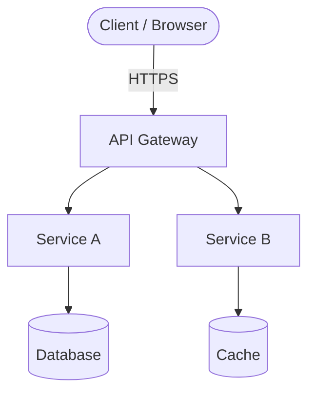

# System Design: [System / Feature Name]

> **When to use:** For any non-trivial system — new services, major subsystems, or significant redesigns. This doc is the single source of truth for the technical design before implementation. It is not a post-hoc description; write it first, then build.

---

## 1. Meta

**Author:** [Name]
**Date:** [YYYY-MM-DD]
**Status:** `Draft` | `In Review` | `Approved` | `Implemented`
**Related spec:** [Link to feature-spec-template.md or requirement IDs]
**Reviewers:** [Names / handles]

---

## 2. Problem

[2–4 sentences: what exactly needs to be built and why? Frame this in terms of user/system needs, not implementation choices. A reader who knows nothing about the project should understand what problem this solves.]

---

## 3. Requirements

### Functional Requirements

| ID    | Requirement                                                        | Priority              |
| ----- | ------------------------------------------------------------------ | --------------------- |
| FR-01 | [The system shall / must / should — one atomic capability per row] | Must / Should / Could |
| FR-02 | [Requirement]                                                      | Must                  |
| FR-03 | [Requirement]                                                      | Should                |

### Non-Functional Requirements

| ID     | Category        | Requirement                                                   | Target / SLO        |
| ------ | --------------- | ------------------------------------------------------------- | ------------------- |
| NFR-01 | Performance     | [e.g. API p99 latency under normal load]                      | < [N] ms            |
| NFR-02 | Availability    | [e.g. Monthly uptime for production service]                  | [N]%                |
| NFR-03 | Scalability     | [e.g. System must handle X concurrent users / events/sec]     | [N] RPS / [N] users |
| NFR-04 | Security        | [e.g. All data at rest and in transit must be encrypted]      | AES-256 / TLS 1.3   |
| NFR-05 | Maintainability | [e.g. New engineers should be able to run the system locally] | < [N] minutes setup |

---

## 4. Constraints

> Hard limits that are not negotiable — budget, existing stack, compliance, deadlines.

- **Tech stack:** [Languages, frameworks, cloud provider already in use that must be respected]
- **Budget / cost ceiling:** [If relevant]
- **Compliance:** [GDPR, SOC2, HIPAA, or other regulatory constraints]
- **Timeline:** [Hard deadline if any]
- **Team size / skills:** [Relevant capability constraints]

---

## 5. High-Level Design

[Describe the overall architecture in prose. Explain the main components and how they relate. Then provide a diagram.]



> Replace the placeholder diagram above with one that reflects your actual components. Add swimlanes, sequence diagrams, or ER diagrams in additional code blocks as needed.

**Component summary:**

| Component     | Responsibility                   | Technology / Package           |
| ------------- | -------------------------------- | ------------------------------ |
| [Component A] | [Single-sentence responsibility] | [e.g. Express, Next.js, Kafka] |
| [Component B] | [Responsibility]                 | [Technology]                   |

---

## 6. Data Model

[Describe the core entities and their relationships. Include a schema definition (TypeScript interface, SQL DDL, or Prisma schema) for each key entity.]

```typescript
// Example entity — replace with your actual model
interface [EntityName] {
  id: string;         // [description, e.g. UUID v4]
  [field]: [type];    // [description]
  createdAt: Date;
  updatedAt: Date;
}
```

**Relationships:**

- `[EntityA]` has many `[EntityB]` (via `[foreignKey]`)
- `[EntityB]` belongs to `[EntityA]`

**Storage:** [Database type, e.g. PostgreSQL 16, SQLite, Redis] — [justification for choice]

---

## 7. APIs

> Define the public interface of the system. Use whichever format matches your stack (REST, tRPC, GraphQL, RPC, CLI, etc.).

### [Endpoint / Method name]

```
[METHOD] /[path]
```

**Request:**

```json
{
  "[field]": "[type — description]"
}
```

**Response (200 OK):**

```json
{
  "[field]": "[type — description]"
}
```

**Error responses:**

| Status | Condition                        |
| ------ | -------------------------------- |
| 400    | [Validation failure description] |
| 401    | [Authentication failure]         |
| 404    | [Resource not found]             |
| 500    | [Internal error]                 |

> Add one subsection per API endpoint or exported function. Omit internal-only helpers.

---

## 8. Scaling & Observability

### Scaling strategy

[How will the system handle 10×, 100× current load? Describe horizontal scaling, caching layers, queue depth, and database read replicas or sharding strategy.]

- **Stateless / stateful:** [Is the service stateless? If stateful, how is state managed across instances?]
- **Caching:** [What is cached, TTL, invalidation strategy]
- **Queue / async processing:** [If workload can be deferred, describe the queue and worker design]

### Observability

| Signal  | Tool / Approach                         | Key metrics / events to capture            |
| ------- | --------------------------------------- | ------------------------------------------ |
| Logs    | [e.g. structured JSON to stdout → Loki] | [Request ID, user ID, error code, latency] |
| Metrics | [e.g. Prometheus + Grafana]             | [Request rate, error rate, p99 latency]    |
| Traces  | [e.g. OpenTelemetry → Jaeger]           | [Critical path spans, DB query durations]  |
| Alerts  | [e.g. PagerDuty / Slack webhook]        | [Error rate > X%, latency > Y ms]          |

---

## 9. Trade-offs

> Every design choice involves trade-offs. Be explicit. This section should be the most honest part of the document.

| Decision                         | Chosen approach | What we gain | What we sacrifice / accept |
| -------------------------------- | --------------- | ------------ | -------------------------- |
| [e.g. Monolith vs microservices] | [Chosen option] | [Benefit]    | [Cost or risk]             |
| [e.g. SQL vs NoSQL]              | [Chosen option] | [Benefit]    | [Cost or risk]             |
| [e.g. Sync vs async processing]  | [Chosen option] | [Benefit]    | [Cost or risk]             |

**Known unknowns / open questions:**

- [ ] [Question that must be answered before or during implementation]
- [ ] [Assumption that needs validation with load testing / a spike]

---

## 10. References

- [Related architecture review doc]
- [Feature spec or requirement IDs]
- [Prior art / external references / ADRs]
